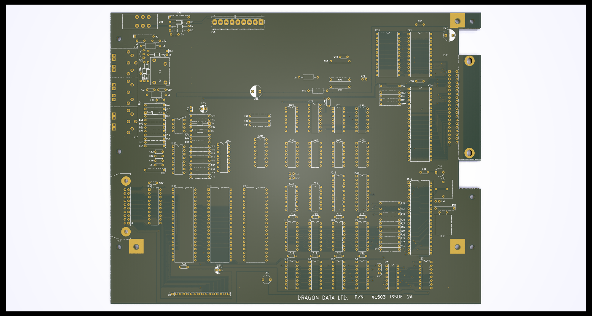
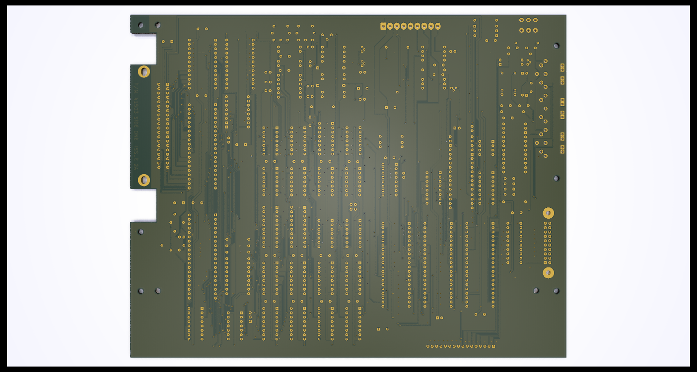

# Dragon 32 Issue 2a (SECAM) Reproduction

This repository contains the KiCad project files
to reproduce the SECAM variation of the Dragon 32
Issue 2a main board.

This design requires the SECAM power board to operate
correctly and will not work with the standard board.

## Notes

The board incorporates some factory bodges to simplify
assembly efforts.

A front and back ground plane fill has also been added
along with effort to make sure that a ground plane is 
present across most of the board.
