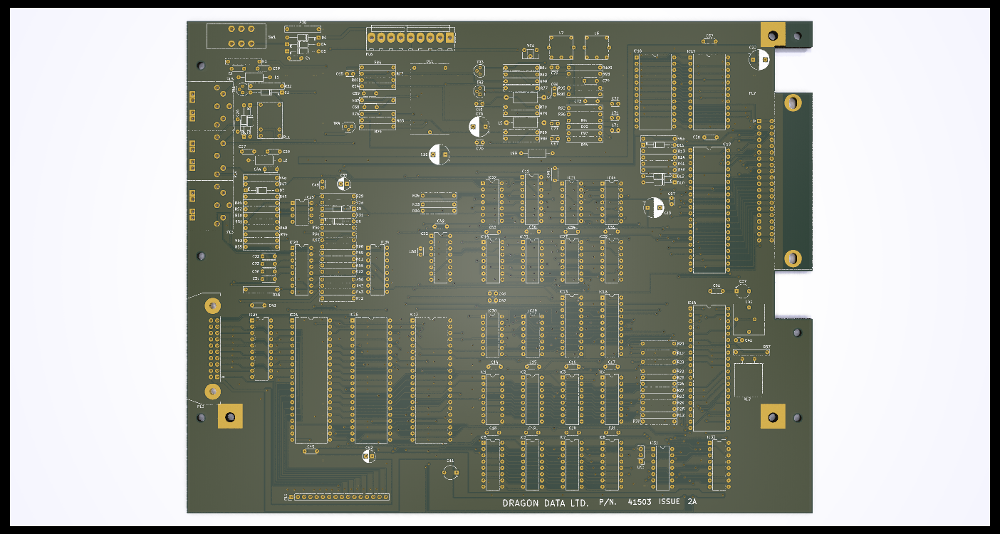
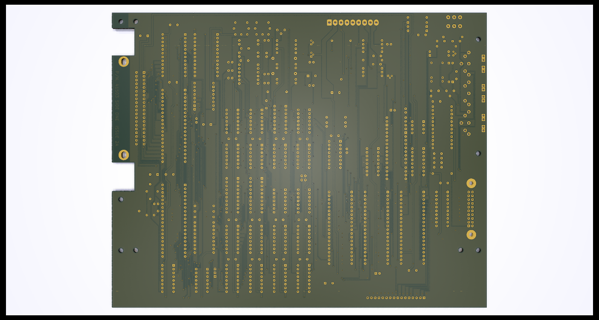

# Dragon 32 Issue 2a (SECAM) Reproduction

This repository contains the KiCad project files
to reproduce the SECAM variation of the Dragon 32
Issue 2a main board.

This design requires the SECAM power board to operate
correctly and will not work with the standard board.
See https://github.com/jimbro1000/Dragon32PowerSecam

## Notes

The board incorporates some factory bodges to simplify
assembly efforts.

A front and back ground plane fill has also been added
along with effort to make sure that a ground plane is 
present across most of the board.

## Video Circuit Changes

Compared to the original Dragon 32 (in PAL or NTSC form)
the SECAM version of the design requires a significant 
level of additional work to generate a viable composite
signal.

The most significant change is that the board does not 
make use of a modulator chip (the LM1889N is used on
the PAL version). Instead the generation of the FM based
composite signal is generated through discrete components.

The board is effectively split into two areas. The regular
PAL design (with a few small tweaks) and the SECAM composite
generation - located in the north section of the PCB.

## Power Board Changes

While the same 9 wire interconnect is present on both
designs, the SECAM version repurposes the 5 non-voltage
connections making the power board incompatible with the
PAL/NTSC main board and the SECAM main board incompatible
with the PAL/NTSC power board.

The original pin out provided ground, composite, audio, 5v
and a bias voltage.

The SECAM board uses the same pins as audio, composite,
luma, phiA and phiB (the last 3 forming a YPrPb signal). 
By passing the raw output of the VDG to the power board
there is space to perform additional transformation into
a genuine RGB output that is sorely missing from the original.

### RGB Calculation

The transformation is performed in two stages - first to
homogenise the signal levels of the VDG output (while it 
broadly follows the YPrPb format it doesn't meet the requried
signal voltages). The second stage performs some analogue
computation to create R-Y, G-Y and B-Y components. These
then can be added to the homogenised Y signal to create
the three R, G and B signals.

An exta calculation is needed to isolate the sync signal
that appears on the G channel.